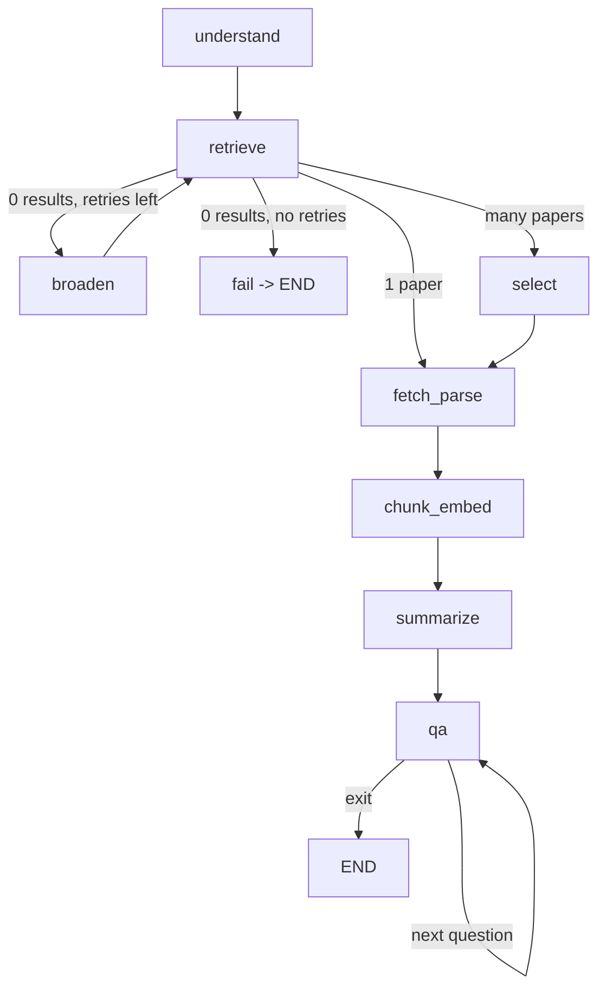

# arXiv Paper Digest & QA Agent

An agent that takes a research topic or an arXiv ID/URL, fetches the paper, and produces a structured executive briefing. You can then ask follow-up questions, and answers are grounded in the paper via RAG.

Built with **LangGraph** (explicit state graph), **Groq** (free tier LLM), **ChromaDB** (local vector DB), **sentence-transformers** (local embeddings) and **PyMuPDF**.

## Architecture



### Nodes

| Node | What it does |
|---|---|
| `understand` | Regex detects an arXiv ID/URL. Otherwise an LLM extracts search keywords and decides relevance vs. date sort |
| `retrieve` | Calls the arXiv API (by ID, or keyword search) |
| `broaden` | On zero results, switches the query from AND to OR (max 2 retries) |
| `select` | LLM picks the best paper from candidates and gives a reason; falls back to the top result if ranking fails |
| `fetch_parse` | Downloads the PDF, extracts text with PyMuPDF, splits into sections. Falls back to abstract-only mode on failure |
| `chunk_embed` | Chunks text and stores embeddings in a persistent Chroma collection |
| `summarize` | Produces the structured briefing (JSON + Markdown) |
| `qa` | RAG loop: rewrites follow-ups into standalone questions, retrieves chunks, answers with citations |

### State shape (`src/state.py`)

| Key | Purpose |
|---|---|
| `user_input`, `intent`, `arxiv_id`, `keywords`, `sort_by`, `retries` | Query understanding and retry control |
| `candidates`, `selected` | arXiv metadata for candidate papers and the chosen one |
| `sections`, `parse_quality` | Parsed text by section; `full` or `abstract_only` |
| `collection_name` | Reference to the on-disk Chroma collection |
| `briefing` | Final structured briefing |
| `chat_history` | Q/A turns, used to rewrite follow-up questions |
| `error`, `done` | Failure message and loop termination flag |

Routing is done with conditional edges (`route_after_retrieve`, `route_after_qa`).

## Setup

Requires Python 3.10+.

```bash
git clone https://github.com/nehaanjumm/arxiv-paper-agent.git
cd arxiv-paper-agent
python -m venv venv
venv\Scripts\activate          # Windows
# source venv/bin/activate     # Mac/Linux
pip install -r requirements.txt
```

Create a `.env` file in the project root:

```
GROQ_API_KEY=your_key_here
GROQ_MODEL=openai/gpt-oss-120b
```

Get a free key at https://console.groq.com. Available models differ per account, so if you get a `model_not_found` error, list your models and set `GROQ_MODEL` accordingly.

**Rate limits:** Groq's free tier has per-minute token limits. `src/llm.py` retries with backoff on rate-limit errors. If it still fails, wait a minute and rerun.

The first run downloads the embedding model (~90 MB).

## Run

```bash
python main.py 1706.03762
python main.py https://arxiv.org/abs/2005.14165
python main.py "KV-cache compression for LLMs"
```

Type a question at the prompt, or `exit` to quit. Briefings are saved to `outputs/<arxiv_id>.md` and `.json`.

## Example runs

### 1. Paper ID: `1706.03762` (Attention Is All You Need)

The briefing is saved at [`outputs/1706.03762.md`](outputs/1706.03762.md).

**QA exchanges:**

```
Q: What optimizer and learning rate schedule were used?
A: The models were trained with the Adam optimizer (β1 = 0.9, β2 = 0.98, ε = 10⁻⁹) and a
   learning-rate schedule that linearly ramps up for the first warmup_steps (4000 steps)
   and then decays proportionally to the inverse square root of the step number [1].
   Sources: sections → background, conclusion, results

Q: How does it compare to the baselines?          (follow-up, rewritten to standalone)
A: The Transformer ... attains substantially higher BLEU scores (28.4 on English-German and
   41.8 on English-French) while requiring far less training cost than earlier
   state-of-the-art systems [1][5].
   Sources: sections → abstract, background

Q: Who is the president of France?                (out of paper)
A: I couldn't find that in the paper.
```

### 2. Topic search: `"KV-cache compression for LLMs"`

The strict AND query returned nothing, so the agent broadened it to OR and found candidates:

```
⚠️  No results, broadening query...
📌 Selected [2]: Directly focuses on KV-cache compression techniques achieving high compression ratio
📄 Lossless KV Cache Compression to 2%  (2410.15252)
```

Briefing excerpt:

```
## Key results
- CLLA-quant reduces KV cache memory usage to as low as 2% of the original size while maintaining comparable performance.
- English benchmark average accuracy: MHA 56.73, GQA 56.83, MLA 57.16, CLLA 57.97, CLLA-quant 57.98.

## Limitations
- The CLLA-quant structure is relatively complex, making practical deployment harder.
- Current experiments focus mainly on KV cache size reduction; further work is needed to lower the time complexity of the attention block.
```

### 3. Failure case: `"asdkjhqwe zzxxyy"`

```
⚠️  No results, broadening query...
⚠️  No results, broadening query...
❌ No papers found. Try a different/broader topic or a direct arXiv ID.
```

The agent retries twice, then exits cleanly without crashing.

### 4. Large paper: `https://arxiv.org/abs/2005.14165` (GPT-3)

The URL is parsed to an ID, and the 60-page cap keeps the run bounded. A full briefing was generated, with explicit limitations, and inferred ones tagged `(inferred)`.

## Design Decisions & Tradeoffs

**Explicit graph instead of one prompt chain.** Each stage is a node that reads and writes a shared `AgentState`, so routing (retry, select, fail) is visible in the graph rather than buried in prompts.

**Metadata comes from arXiv, not the LLM.** Title, authors, date and link are copied from the API response, so these fields cannot be hallucinated. The LLM only writes the analytical parts.

**Limitations are enforced.** The prompt requires a non-empty limitations list. If the paper doesn't state any, the model must infer them and tag each with `(inferred)`, so readers can tell stated from inferred.

**Grounded QA, three layers.**
1. Retrieval threshold: chunks with cosine distance above 0.7 are dropped. If none remain, the agent answers "I couldn't find that in the paper." without calling the LLM at all.
2. Prompt: answer only from numbered excerpts and cite them.
3. Follow-up rewriting: questions like "how does it compare?" are rewritten into standalone questions using chat history, so retrieval works on them.

**Chunking.** 1000-character windows with 150 overlap, breaking at sentence ends where possible. Big enough to keep a full idea, small enough for precise retrieval. The abstract from arXiv metadata is always indexed, since it is more reliable than parsed PDF text.

**State between summarize and QA.** The graph state (a dict) carries metadata, the briefing and chat history in memory. Vectors persist on disk in Chroma, and only a collection name is passed through the state.

**Failure handling.**
- Zero results: broaden AND to OR, up to 2 retries, then a friendly error.
- Many results: LLM selection; falls back to the top search result if that call fails.
- PDF download or parse failure, or too little text (scanned PDFs): abstract-only mode with a visible warning.
- Huge papers: capped at 60 pages and 30 MB.
- LLM rate limits: backoff and retry.

**Summarization context.** Only selected sections (~12k characters) are sent to the LLM to fit free-tier limits.

## Known Limitations

- **Summaries can be imprecise.** Since summarization sees truncated text, a detail can be wrong. In the GPT-3 run, one bullet about the smallest model size did not match the paper.
- Section detection is regex-based, so section labels in QA sources are approximate (e.g. training details may be labelled under another section).
- Tables and equations parse poorly with plain text extraction.
- Scanned PDFs are not OCR'd, so they fall back to abstract-only mode.
- One paper per session.
- The 0.7 distance threshold was tuned by hand on a few papers.

## What I'd do with more time

- Map-reduce summarization over the full paper instead of truncated sections
- Hybrid search (BM25 + embeddings) and a reranker
- OCR fallback for scanned PDFs
- Multi-paper comparison
- A small evaluation set to tune the threshold and measure grounding
- Streamlit or notebook interface